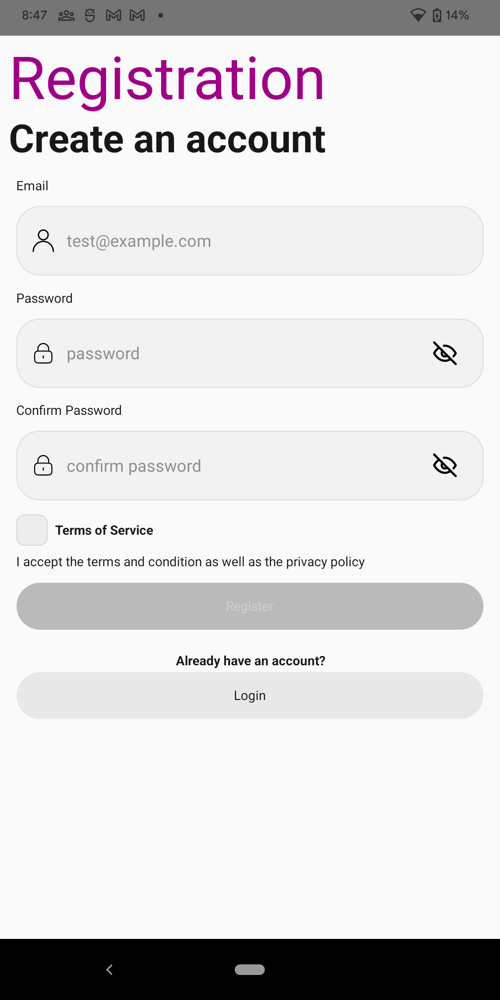
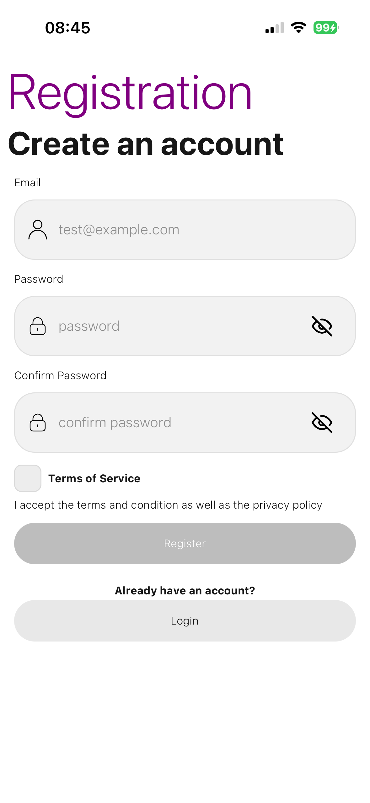

# Simple app that demonstrates setting AWS Cognito with custom UI components

## Following are the features that this app will demonstrate:

- [x] Registration
- [ ] Login
- [ ] Forgot Password
- [ ] AWS CDK setup for Cognito
- [ ] Unit test with Jest
- [ ] Integration testing with Detox

## Screenshots

### Android

### iOS

